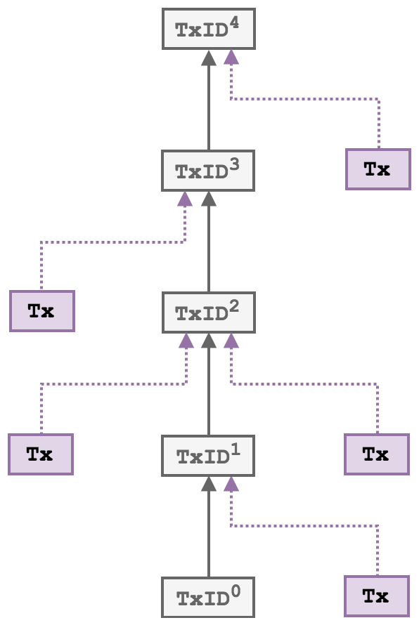
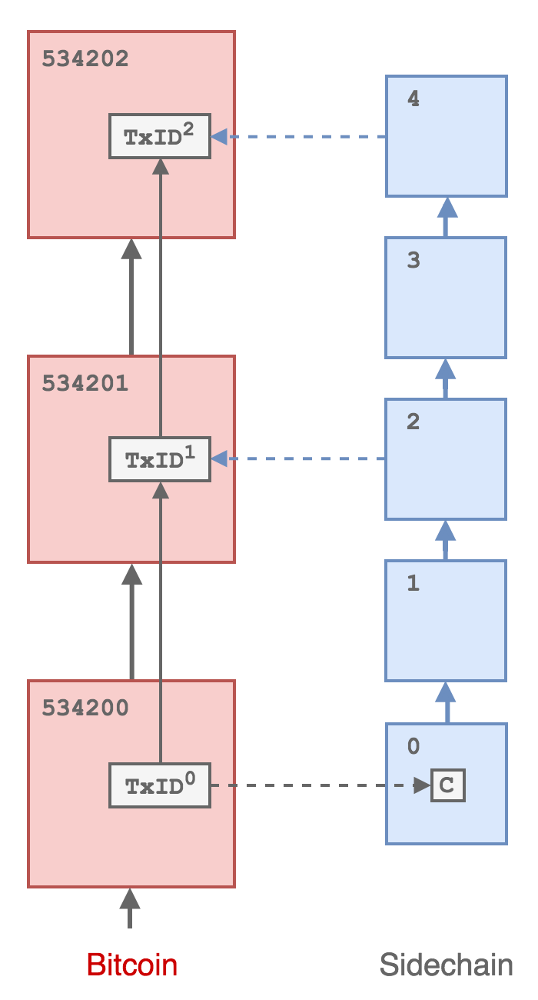

# Mainstay Protocol

The MainStay protocol employs the underlying concept of a *staychain* of linked transactions within the Bitcoin blockchain,
where all transactions in the staychain conform to having only a a single output,
preventing branching and any possibility of alternate staychain
histories. By anchoring the staychain *base* transaction ID into the genesis block of the sidechain (or other sequence of linked states),
and then committing the state of this sequence at regular intervals into the staychain, it
becomes impossible to roll back or re-write the state of the sequence without also rolling
back the staychain, which is effectively impossible due to the might of Bitcoin’s global proof-
of-work. Anyone nodes can validate these commitments and the resulting immutability of
the staychain via a connection to a Bitcoin full node. When a sequence of states has been committed to a Bitcoin staychain, this block has been *reinforced* and is as
immutable as a Bitcoin block of the same depth.

To minimise the encumbrance of the mainstay on the Bitcoin blockchain, and to prevent any
potential miner censorship of transactions containing `OP_RETURN` outputs, a
homomorphic commitment scheme based on the ‘pay-to-contract’ ([BIP175](https://github.com/bitcoin/bips/blob/master/bip-0175.mediawiki>)) protocol is employed. In this approach, commitments from the sidechain are embedded in a single transaction output
address, and the staychain is indistinguishable from normal Bitcoin payment transactions.
The scheme has been designed so that it is compatible with both multisig (P2SH) and single
public key (P2PKH) addresses via [BIP32](https://github.com/bitcoin/bips/blob/master/bip-0032.mediawiki) derivation paths.

The aim of the MainStay protocol is to restrict a sequence of periodic commitments from an external system (referred to here as
the *sidechain* without loss of generality) to
an un-forkable staychain of transactions in Bitcoin, and to uniquely
bind this staychain to the sidechain by commiting the transaction identifier directly the sidechain genesis block. We define a staychain
as a sequence of linked transactions where each one has only a single output - transactions
can have more than one input (*fan-in*), but maintaining single outputs means only one
sequence of commitments is possible from a given initial transaction. Each unique
transaction output then represents a *single use seal*.

If the security proposition of a sidechain depends on the Mainstay proof-of-immutability then
the mechanism of propagating the staychain must be robust and reliable: if the
staychain fails to propagate or is corrupted (e.g. having multiple outputs) then new sidechain state changes (i.e. blocks)
will lose the guarantee of immutability - however it will always remain *fail secure* (i.e. previously reinforced transactions are provably unique without trust).

## Single-key protocol

In the following general description of the protocol, we assume a single Mainstay key and signing entity. The
protocol is also presented in relation to Bitcoin as the proof-of-work mainchain, but it is in
principle compatible with any PoW blockchain.



A schematic of a *fan-in-only* chain of linked transactions - a **staychain**. By enforcing single
outputs only one possible sequence of transactions is possible.

## Initialisation

The initial step in the protocol is the creation of the base transaction ``TxID[0]``, which is
performed before the initialisation of the sidechain.

1. The signing entity generates a BIP32 extended master private key `xpriv` , and corresponding extended master public key `xpub`. The extended public key is then used to create the base address: `Addr[0]` with a derivation path of `m/0`.
2. The signing entity then creates a transaction (the *base transaction* `BaseTx`) paying an amount of BTC (to cover at least initial transaction fees) to the base address `Addr[0]` as a single P2WPKH output.
3. This transaction is broadcast to the Bitcoin network: once it is confirmed in the Bitcoin blockchain it acquires a globally unique transaction ID that is a pointer to the start of the staychain: `TxID[0]`.
4. The pointer `TxID[0]` is committed directly into the linked system (e.g. the genesis block of a sidechain). 

## Commitments

The frequency of state commitments is determined by the signing entity : the sidechain may
generate blocks more frequently but can only attest once per Bitcoin block (average every
10 minutes). The process of attestation will occur as follows:

1. At each interval `j`, the signing entity will retrieve the system commitment (e.g. sidechain latest blockhash). 
2. The 32 byte `blockhash[j]` is then split into 16 2-byte parts, which are then converted into an array of 16 integers `bhint[16]`.
3. A BIP32 derivation path (the commitment path `path[j]`) is formed from this integer array sequence, and prepended with `m/0`.
4. The commitment address `Addr[j]` is then derived from the `xpub` with `path[j]`.

For example:

```
blockhash_j = 310057788c6073640dc222466d003411cd5c1cc0bf2803fc6ebbfae03ceb4451

path_j = m/0/12544/22392/35936/29540/3522/8774/27904/13329/52572/7360/48936/1020/28347/64224/15595/17489
```

5. The signing entity then creates a Bitcoin transaction with one input spending the single output of transaction `TxID[j-1]`
(initially the base transaction when `j = 1`) and paying to a single
P2PKH output with address `Addr[j]`
6. The transaction is then signed using the private key derived from `xpriv` with `path[j-1]`
7. The valid transaction is then broadcast to the Bitcoin network. Once it is confirmed
in a block, it is referenced by transaction ID: `TxID[j]`



Schematic of the mainstay protocol. Dashed lines represent commitments.

## Verification

A state in an external sequence that has a mainstay commitment is known as *reinforced*
and has the same immutability guarantees as a confirmed Bitcoin block. For any client or
user to confirm the status of a sequence of states only requires connections to both Bitcoin and states.
No additional information, beyond what is included
in the sidechain and Bitcoin blockchains, is required to validate direct mainstay reinforcements.

This confirmation functions as follows:

1. The base transaction ID `TxID[0]` is retrieved from the sidechain genesis block along with the master `xpub`.
2. `TxID[0]` is retrieved from the Bitcoin blockchain.
3. The staychain is tracked until the unspent tip `TxID[t]`, confirming each component transaction consists of only a single output:

```
TxID[0] → TxID[1] → TxID[2] → TxID[3] → ... → TxID[t]
```

4. The single output P2PKH address of `TxID[t]` is retrieved: `Addr[t]`.
5. Starting at the tip (most recent state) of the sequence of states (state `w`) with hash `hash[w]`, the corresponding BIP32 path is determined: `path[w]`.
6. `Addr[w]` is derived from `path[w]` and the master `xpub`.
7. If `Addr[w]` equals `Addr[t]` state `w` on the sequence of states (and all below it) are confirmed as reinforced.
8. If not true, the sequence state height is decremented: ``w ← w − 1`` and the check repeated.

The above protocol would only need to be followed for the initial sync of a mainstay connected
node: once the staychain tip transaction `TxID[t]` has been identified, additional attestations
can be confirmed by monitoring when `TxID[t]`
is removed from the Bitcoin UTXO set. The new staychain tip `TxID[t+1]` will then be included in the most recent Bitcoin block.

## Staychain feed in

To maintain the persistent operation of a staychain, it must be continually funded to pay
for mainchain (Bitcoin) mining fees. The staychain can always be funded with a substantial
amount of Bitcoin at the beginning (i.e. at the base transaction stage) however it may
be required to ‘top-up’ the funding at a later stage. This is possible without breaking
the immutability of the staychain: the only required condition for immutability is that
there is always only one output of any transaction in the chain - and that the staychain
cannot bifurcate. Inputs however can be added by anyone: additional funding can be added
with `SIGHASH_ANYONECANPAY` inputs. The base transaction will always define the
commitment sequence through to the tip.
